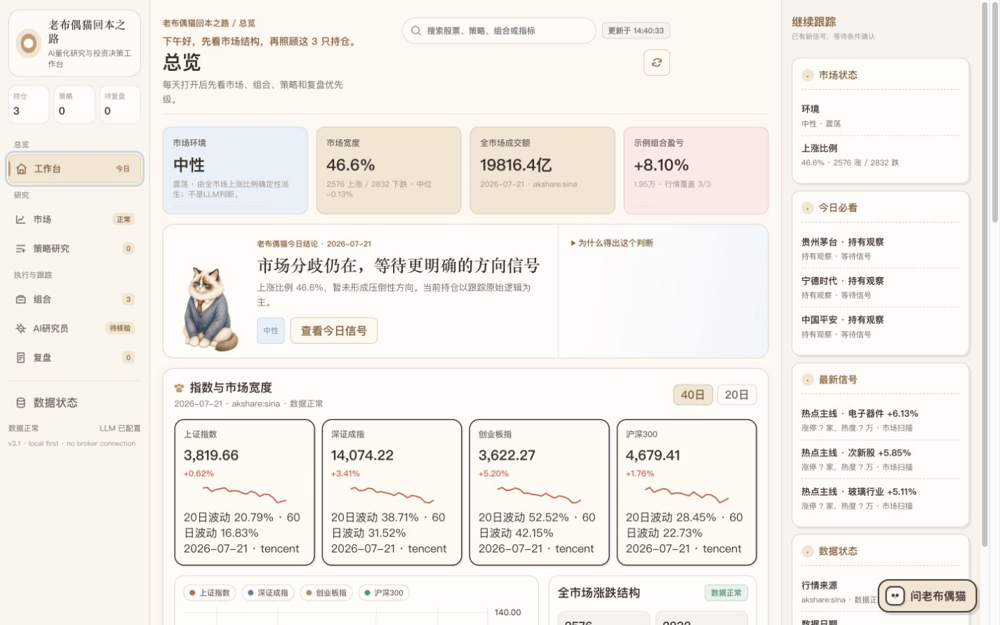
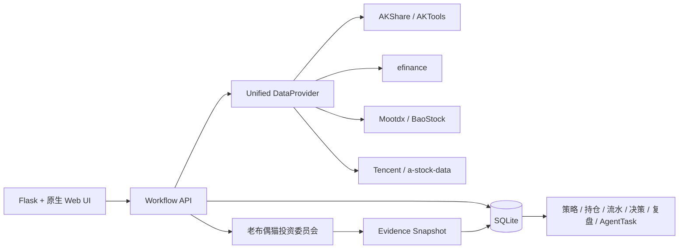

# 老布偶猫量化工作台

> Evidence-first A 股投资研究与复盘工作台：不替用户预测涨跌，而是让每次判断有依据、有约束、能复盘。

[静态交互演示](https://han21357.github.io/ragdoll-break-even-quant-workbench/demo.html) · [作品展示页](https://han21357.github.io/ragdoll-break-even-quant-workbench/) · [项目介绍 PDF](output/pdf/ragdoll-quant-workbench-introduction.pdf) · [面试讲解指南](docs/INTERVIEW_GUIDE.md)

静态演示与当前产品共用模板、组件样式和前端逻辑，只把后端替换为脱敏快照与浏览器内存操作，因此可在 GitHub Pages 上保持与本地版本一致的视觉和主要交互。



## 给面试官的 30 秒版本

| 项目要素 | 内容 |
|---|---|
| 项目角色 | 个人项目：产品定义、信息架构、数据契约、交互设计、前后端实现与验证 |
| 用户问题 | 行情、策略、持仓和复盘分散；结论缺少来源、失效条件和后验验证 |
| 核心判断 | 投资 AI 的可信度不来自“敢给结论”，而来自“能解释、能制衡、能复盘” |
| 产品方案 | 统一数据层 + 策略 DSL + 真实持仓 + 多角色投委会 + 证据快照 + 到期复盘 |
| 交付证据 | 可运行 Flask/SQLite 源码、静态交互演示、真实本地截图、31 项自动化测试 |
| 安全边界 | 公网只发布脱敏静态页面；后端默认仅监听本机，不连接券商、不自动下单 |

## 为什么做这个产品

个人投资者并不缺行情和观点，真正缺少的是一套持续的判断管理机制：

1. 当时使用了什么数据，数据是哪一天、来自哪里？
2. 哪些关键字段缺失，为什么仍然形成这个判断？
3. AI、规则和用户本人分别做了什么决定？
4. 后来结果不理想，是判断错了、执行偏了，还是市场条件变了？

因此，本项目没有把目标设为“再做一个荐股工具”，而是把市场观察、策略验证、持仓决策和复盘组织为一条可追溯工作流。

```text
市场/板块 -> 观察池 -> 策略 DSL -> 股票筛选 -> 模拟组合
-> 真实持仓 -> 投资委员会 -> 用户确认决策 -> 到期复盘 -> 策略新版本
```

## 三个关键产品决策

### 1. 缺失数据必须可见

页面不直接调用第三方接口。统一 `DataProvider` 负责主备切换、超时重试、缓存、增量更新和字段标准化。每次响应携带：

```text
data + data_date + source + updated_at + completeness
+ cache_status + missing_fields + error + provenance
```

数据源全部失败时可以使用明确标记为 `stale` 的最近成功快照；无法可靠计算的字段保留 `null` 和缺失原因，不用 `0` 或随机值伪装完整。

### 2. AI 结论必须经过人工门禁

基本面、估值、行业、趋势、风险和反方角色分别取证，主席汇总时保留分歧与缺失项。AI 不能自动交易；用户确认动作、理由、失效条件和复盘日期后，系统才保存正式决策。

### 3. 复盘评价判断过程，不只看盈亏

系统保存证据快照、策略版本、交易流水和用户修改记录。到期复盘分别评价判断质量、执行质量、认知偏差和下一次调整，避免简单地用“赚了就是对、亏了就是错”评价策略。

## 3 分钟演示路线

无需后端即可打开[静态交互演示](https://han21357.github.io/ragdoll-break-even-quant-workbench/demo.html)：

1. **工作台**：查看行情、持仓和复盘任务如何汇总为“今日结论”。
2. **市场**：把一个板块加入观察池，理解证据保存入口。
3. **策略研究**：将自然语言想法转换为可编辑 DSL，并查看缺失因子。
4. **组合**：使用股票名称、代码、拼音或首字母模糊搜索并加入演示组合。
5. **AI 研究员**：运行固定样例投委会，查看证据值、分歧和人工确认边界。
6. **复盘**：展开当时证据，区分判断偏差与执行偏差。

静态演示使用明确标注的脱敏样例数据，不连接 Flask、实时行情、LLM、数据库或券商。

## 核心能力

- **市场研究**：全 A 涨跌家数、中位数、成交额、指数历史、20/60 日波动率、市场宽度和板块持续性。
- **可解释策略**：自然语言想法转换为可编辑、可校验、可版本化的策略 DSL，再进入筛选和回测。
- **持仓导入**：支持手工搜索、粘贴券商表格、CSV/XLSX 和模拟组合转入；自动识别字段与冲突。
- **模糊股票搜索**：预载 A 股基础目录，支持代码片段、中文名、拼音和首字母。
- **组合分析**：复权价格、今日及累计收益、最大回撤、波动率、仓位、行业集中度和单股暴露。
- **多角色投委会**：独立角色取证、主席汇总、持久化任务、取消/重试、证据快照和人工门禁。
- **决策与复盘**：记录理由、风险、失效条件、用户修改和复盘日期，并生成策略修订版本。
- **品牌体验**：老布偶猫根据时间、市场、持仓压力和复盘任务切换状态，在专业工具中保留陪伴感。

## 系统架构



更完整的技术说明：

- [架构设计](ARCHITECTURE.md)
- [数据来源与血缘](docs/DATA_PROVENANCE.md)
- [数据缺口审计](docs/DATA_GAP_AUDIT.md)
- [策略 DSL](docs/STRATEGY_DSL.md)
- [回测假设](docs/BACKTEST_ASSUMPTIONS.md)
- [交互与数据链路审计](INTERACTION_AUDIT.md)

## 本地运行

推荐 Python 3.11：

```bash
git clone https://github.com/Han21357/ragdoll-break-even-quant-workbench.git
cd ragdoll-break-even-quant-workbench

python3 -m venv .venv
source .venv/bin/activate
pip install -r requirements.txt
cp .env.example .env
./start-server.sh
```

打开 `http://127.0.0.1:8766`。后端默认仅监听本机回环地址；Tushare、AKTools 和 LLM 密钥均为可选配置。

动态服务不得通过临时隧道从本机或公司设备暴露到公网。经批准环境的身份认证、密钥管理、数据库、网络与审计要求见[部署与安全边界](docs/DEPLOYMENT.md)。

## 验证

```bash
python3 -m pytest -q
node --check app/static/js/app.js
node --check app/static/js/api.js
git diff --check
```

当前结果：`31 passed, 4 skipped`。跳过项属于需要可选外部能力或网络条件的测试。GitHub Actions 会在每次推送后使用 Python 3.11 重新验证。

## 项目边界与取舍

- 不连接券商账户，不自动下单，不承诺收益。
- GitHub Pages 仅托管静态交互副本，不提供动态后端。
- 静态演示中的数值只用于展示信息结构，并持续标注为脱敏样例。
- 本地真实系统会展示数据日期、来源、完整度和缺失原因。
- SQLite 适合个人本地工作台；多人生产环境需要受管数据库、权限与审计体系。
- AI 能力依赖可选密钥；未配置时界面明确降级，不伪装为已经完成分析。

## 技术栈

Python、Flask、SQLite、Pydantic、原生 JavaScript/CSS、Lightweight Charts、AKShare、efinance、Mootdx、BaoStock、LangGraph、pytest、GitHub Actions。

## English Summary

**Old Ragdoll Cat Quant Workbench** is an evidence-first A-share investment research and review workspace. It combines resilient market-data adapters, explainable strategy DSLs, position imports, a role-based AI investment committee, decision evidence snapshots, and due-date reviews. The public website is a sanitized static interaction demo; the dynamic backend runs locally or in an approved authenticated environment only.
