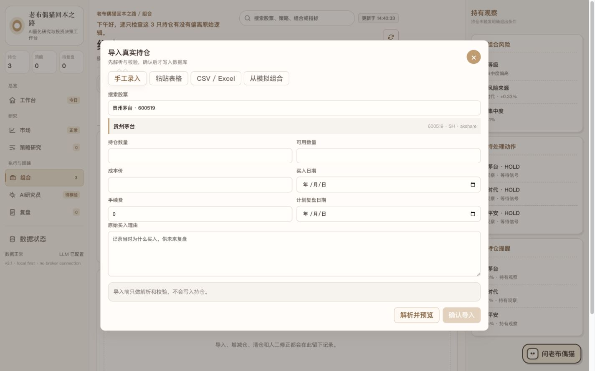
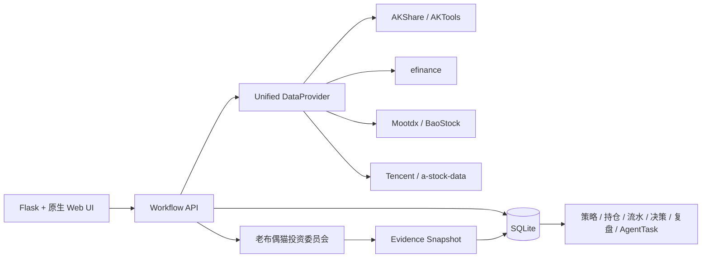

# 老布偶猫量化工作台

> 一款有温度、可追溯、以真实数据驱动的个人投资研究与复盘工作台。

[在线作品展示](https://han21357.github.io/ragdoll-break-even-quant-workbench/) · [项目介绍 PDF](output/pdf/ragdoll-quant-workbench-introduction.pdf) · [数据缺失审计](docs/DATA_GAP_AUDIT.md) · [交互审计](INTERACTION_AUDIT.md) · [数据来源说明](docs/DATA_PROVENANCE.md)


## 项目简介

老布偶猫量化工作台将市场观察、策略研究、模拟组合、真实持仓、AI 投委会与到期复盘放进一条可执行的个人投资工作流。产品不追求给出一句“买或卖”的黑箱答案，而是保存每次判断的证据、日期、数据来源、缺失项和失效条件，让用户能够在未来还原“当时为什么这样判断”。

```text
市场/板块 -> 观察池 -> 策略 DSL -> 股票筛选 -> 模拟组合
-> 真实持仓 -> 投资委员会 -> 用户确认决策 -> 到期复盘 -> 策略新版本
```

## 核心亮点

- **真实数据优先**：AKShare 为主源，efinance、Mootdx、BaoStock、腾讯行情等作为备源；Tushare 仅为可选增强。
- **明确的数据降级**：请求支持超时重试、主备切换、本地缓存、增量快照和字段标准化；缺失值显示原因，不使用 `0` 冒充。
- **可解释策略工作流**：自然语言投资想法会转换为可编辑、可校验、可版本化的策略 DSL，再进入筛选和回测。
- **真实持仓导入**：支持手工搜索、粘贴券商表格、CSV/XLSX 和模拟组合转入；自动识别字段并处理重复持仓冲突。
- **模糊股票搜索**：预载 A 股基础目录，支持代码片段、中文名、拼音和首字母；选择后自动回填代码、名称和市场。
- **多角色投资委员会**：基本面、估值、行业、趋势、风险与反方角色独立取证，由主席保留分歧后汇总。
- **证据化决策与复盘**：AI 不能自动交易；用户确认后才保存决策，并可在到期复盘后生成策略修订版本。
- **有温度的金融体验**：老布偶猫会根据时间、市场状态、持仓和复盘任务切换状态，同时保留专业的数据密度。

## 产品界面

### 市场总览

首页同时呈现市场宽度、成交额、指数表现、20/60 日波动率、持仓状态和今日行动。波动率按风险指标表达，不使用收益式颜色和正号。

### 持仓导入



导入过程分为解析、映射、校验、预览和确认五步。持仓写入与交易流水处于同一 SQLite 事务中，避免“页面显示成功但流水缺失”。

## 系统架构



### 数据请求契约

每个统一数据请求返回：

```text
data + data_date + source + updated_at + completeness
+ cache_status + missing_fields + error + provenance
```

数据源全部失败时，系统可返回明确标记为 `stale` 的最近成功快照；无法可靠计算的仓位、Beta、风格暴露等字段会显示具体缺失原因。

## 快速开始

推荐使用 Python 3.11。

```bash
git clone https://github.com/Han21357/ragdoll-break-even-quant-workbench.git
cd ragdoll-break-even-quant-workbench

python3 -m venv .venv
source .venv/bin/activate
pip install -r requirements.txt
cp .env.example .env
./start-server.sh
```

打开 [http://localhost:8766](http://localhost:8766)。Tushare、AKTools 和 LLM 密钥均为可选配置，未配置时不影响项目启动。

实验性研究与回测集成列在 `requirements-optional.txt`，请按实际需求选择安装。其中 AKQuant 含平台相关的原生依赖；未安装或当前平台不兼容时，系统会显示适配器限制，并继续使用项目内置的确定性兼容回测器。

## 验证

```bash
python3 -m pytest -q
node --check app/static/js/app.js
node --check app/static/js/api.js
git diff --check
```

当前验证结果：`31 passed, 4 skipped`。跳过项属于需要可选外部能力或网络条件的测试。

项目介绍 PDF 可重复生成：

```bash
pip install -r requirements-docs.txt
python scripts/build_project_pdf.py
```

## 技术栈

- Python、Flask、SQLite、Pydantic
- 原生 JavaScript、CSS、Lightweight Charts
- AKShare、AKTools、efinance、Mootdx、BaoStock
- ReportLab、pytest

## 项目边界

- 不连接券商账户，不自动下单。
- 不生成随机收益、随机股票或未标注的模拟数据。
- AI 输出是基于有限公开数据和用户记录的研究意见，不构成收益承诺。
- 用户成本、持仓和投资理由仅保存在本地 SQLite，`.env` 与本地数据目录不会提交到 Git。

## English Summary

**Old Ragdoll Cat Quant Workbench** is an evidence-first personal investment research and review workspace for China A-shares. It combines resilient market-data adapters, explainable strategy DSLs, real-position imports, a role-based AI investment committee, decision snapshots, and due-date reviews. The system never trades automatically and never replaces missing data with fabricated values.
